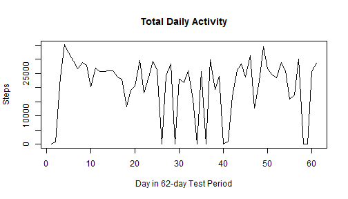
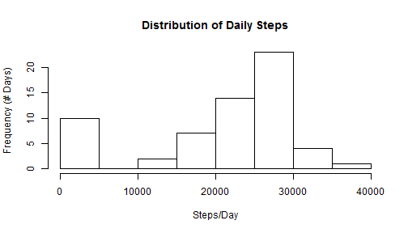
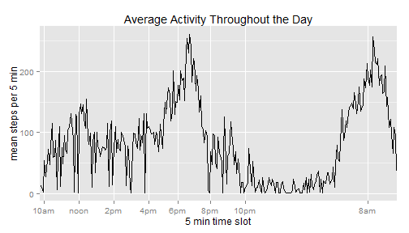
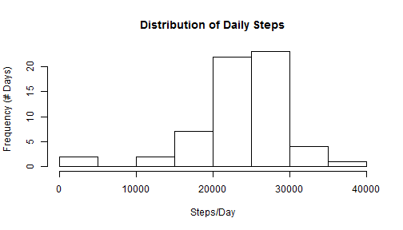
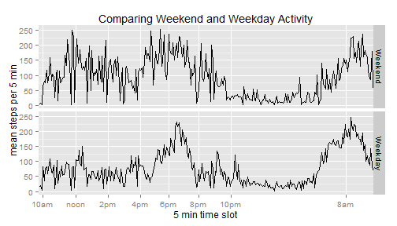

# Activity Monitor Data Analysis
## Introduction
This file documents the analysis that takes a data file generated by an activity monitor (e.g. Fitbit) and produces basic summary data.  The data file used contains 62 days of activity broken into 5 minute segments.  Each row (record) contains the date, time interval and number of steps within that interval.

To ease later analysis, certain quantities are calculated from the raw data.  A data frame with extra columns containing the derived quantites is used to make calculations and generate plots.

## Reading in Data
First we must read in the data file and calculate the needed quanities.  We will need to calculate quantities per day so the variable "day"" is defined from the beginning of the trial (day = 0) to the end of the trial (day = 61).  Note dates are stored as seconds from a reference point so the proper conversion must be used to get the day.


```r
dataURL <- "repdata-data-activity"
Xactivitydf <- read.csv(paste(dataURL, "activity.csv", sep = "/"))
steps <- Xactivitydf[,1]
date <- strptime(Xactivitydf[,2], "%Y-%m-%d")
firstday <- min(date)
day <- trunc((date - firstday)/(60*60*24))
```

## Finding a datetime for time series plotting
To get a proper time series on 5 minute intervals we must have a complete date/time but the data file contains date in one column and time (in a strange format, hhmm, where hh is the hour and mm the minute) in a second column.  The following conversion gets a proper datetime that can be used to plot a time series.  Note that if hourmin is simply converted by turning it into a number it will have strange gaps in the plots.  It counts by 5 until 55 and then skips to 00. An example sequence is: 1035, 1040, 1045, 1050, 1055, 1100, 1105 etc.


```r
hourmin <- Xactivitydf[,3]
hour <- trunc(hourmin/100)
minute <- hourmin - hour*100
datetime <- date + 3600*hour + 60*minute
```

## Weekdays vs. Weekends
Finally we need to know the day of the week so that weekends and weekdays can be compared.  The logical variable "weekday" is used to distinguish between weekdays and weekends and will be a column in our analysis data frame.


```r
dayofweek <- weekdays(datetime)
len <- dim(Xactivitydf)[1]
weekday <- TRUE
weekday[1:len] <- TRUE
for(i in 1:len){
    if(dayofweek[i] == "Saturday"){weekday[i] <- FALSE}
    else if(dayofweek[i] == "Sunday"){weekday[i] <- FALSE}
}
```

## Expanded dataframe for analysis
Combining some of the calculated quantities into a new dataframe will make analysis much easier with dplyr.  A few representative rows of the data frame are shown.


```r
X <- cbind(datetime, dayofweek, weekday, day, hour, hourmin, steps)
names(X) <- c("datetime", "dayofweek", "weekday", "day", "hour", "hourmin", "steps")
X <- data.frame(X)
print(X[c(1000,1300,1700,1900,2200),])
```

```
##        datetime dayofweek weekday day hour hourmin steps
## 1000 1349374500  Thursday    TRUE   3   11    1115     0
## 1300 1349464500    Friday    TRUE   4   12    1215   345
## 1700 1349584500  Saturday   FALSE   5   21    2135     0
## 1900 1349644500    Sunday   FALSE   6   14    1415     0
## 2200 1349734500    Monday    TRUE   7   15    1515  <NA>
```

## Steps per day and mean and median values
We can group the rows in the data frame by day and then sum the steps for each day.  The plots show steps per day as a (1) time series and (2) histogram.  Note that there are 10 days with 0 steps.  This means that the activity monitor was not used on those days (even sleep registers a small but nonzero value).  These zeroes are mostly NA because it must be the case that the monitor was not used.  The sum of a day with mostly NA values will be close to zero.


```r
library(dplyr)
dayData <- group_by(X, day)
StepsPerDay <- summarize(dayData, daysum = sum(steps, na.rm=TRUE))
x <- as.numeric(StepsPerDay$day)
y <- StepsPerDay$daysum
plot(x,y, type = "l", main = "Total Daily Activity", xlab = "Day in 62-day Test Period", ylab = "Steps")
```

 

```r
hist(y, main = "Distribution of Daily Steps", xlab = "Steps/Day", ylab = "Frequency (# Days)")
```

 

```r
print(c("mean steps per day = ", trunc(mean(y))))
```

```
## [1] "mean steps per day = " "20720"
```

```r
print(c("median steps per day = ", median(y)))
```

```
## [1] "median steps per day = " "23871"
```

## Time series of 5-min intervals averaged over all days
Unfortunately hourmin is a factor variable (a counting integer from 1 to 288) this causes some headaches.  Do not use as.integer or as.numeric to convert as this will give a scale with missing values (note that after 1055 comes 1100 NOT 1060... so this factor variable does not count uniformly.  This is actually visible in the example README file as long gaps every hour in the plots).  

The main thing to note in the plot below is that the period of very low activity corresponds to normal "night time" from about 10 pm to 7 am.  Highest activity is in the morning and early evening.  The period of normal work time is at an intermediate level between sleep and high activity.


```r
intervalData <- group_by(X, hourmin)
StepsPerInterval <- summarize(intervalData, intmean = mean(steps, na.rm=TRUE))
g <- ggplot(StepsPerInterval, aes(hourmin, intmean, group = 1))
p <- g + geom_line() 
p <- p + ggtitle("Average Activity Throughout the Day")
p <- p + labs(x = "5 min time slot", y = "mean steps per 5 min")
Ticks = c("1000", "1200", "1400", "1600", "1800", "2000","2200", "800")
Labels = c("10am", "noon", "2pm", "4pm", "6pm", "8pm", "10pm", "8am")
p <- p + scale_x_discrete(breaks = Ticks, labels = Labels)
print(p)
```

 

## Interval of maximum activity
The interval when maximum activity occurs (on average) during the day is given by the following code which compares the value of each interval with the maximum value.  It occurs at 18:45 (6:45pm) which seems to be in the center of a period of evening exercise for this individual.


```r
intmean <- StepsPerInterval$intmean
interval <- StepsPerInterval$hourmin
for(i in 1:288){
    if(intmean[i] == max(intmean)){
        print(c("Interval of maximum activity = ", as.character(interval[i])))
        print(c("Maximum average steps in 5-min period = ", trunc(intmean[i])))
    }}
```

```
## [1] "Interval of maximum activity = " "1845"                           
## [1] "Maximum average steps in 5-min period = "
## [2] "261"
```

## Imputing missing values
A summary of the data frame X reveals that NA values are only found in the "steps" column.  The following code replaces all NA values of X$steps with the mean value for that specific time slot during the day.


```r
len <- length(X$steps)
s <- as.integer(X$steps)
countNA <- 0
for(i in 1:len){
    if(is.na(X$steps[i])){
        m <- i %% 288 + 1
        countNA <- countNA + 1
        s[i] <- as.integer(StepsPerInterval$intmean[m])
    }}
X$steps <- s
dayData <- group_by(X, day)
StepsPerDay <- summarize(dayData, daysum = sum(steps, na.rm=TRUE))
x <- as.numeric(StepsPerDay$day)
y <- StepsPerDay$daysum
print(c("There are", countNA, " NA values in the data set."))
```

```
## [1] "There are"                   "2304"                       
## [3] " NA values in the data set."
```

```r
hist(y, main = "Distribution of Daily Steps", xlab = "Steps/Day", ylab = "Frequency (# Days)")
```

 

```r
print(c("mean steps per day with NA values replaced = ", trunc(mean(y))))
```

```
## [1] "mean steps per day with NA values replaced = "
## [2] "23831"
```

```r
print(c("median steps per day with NA values replaced = ", median(y)))
```

```
## [1] "median steps per day with NA values replaced = "
## [2] "23871"
```

Notice that the mean value changed significantly by replacing NA values with their means for each 5 min period.  The median value, however, was insensitive to the NA replacement.

## Weekday vs. Weekend Average Activity

The code below groups the data in the data frame by both the 5 min time segment and by whether the day is a weekday or a weekend.


```r
library(ggplot2)
weekdayData <- group_by(X, hourmin, weekday)
StepsWeekday <- summarize(weekdayData, intmean = mean(steps, na.rm=TRUE))
g <- ggplot(StepsWeekday, aes(hourmin, intmean, group = weekday))
p <- g + geom_line() + facet_grid(weekday ~ ., labeller = label_bquote(.(if(x){"Weekday"} else{"Weekend"})))
p <- p + ggtitle("Comparing Weekend and Weekday Activity")
p <- p + labs(x = "5 min time slot", y = "mean steps per 5 min")
Ticks = c("1000", "1200", "1400", "1600", "1800", "2000","2200", "800")
Labels = c("10am", "noon", "2pm", "4pm", "6pm", "8pm", "10pm", "8am")
p <- p + scale_x_discrete(breaks = Ticks, labels = Labels)
print(p)
```

 

As we can see from the plot, there is considerably more activity on weekends during the period from the hours of 10am to 5pm.  The activity in the "morning" and "evening" periods seems to be about the same and the sleep periods line up. So this individual appears to have a regular routine of activity in morning and evening which carries over to the weekend.  Sleep time is consistent between weekdays and weekends but daytime activity on weekends (recreation?) is considerably greater than daytime activity on weekdays (sedentary work?).
